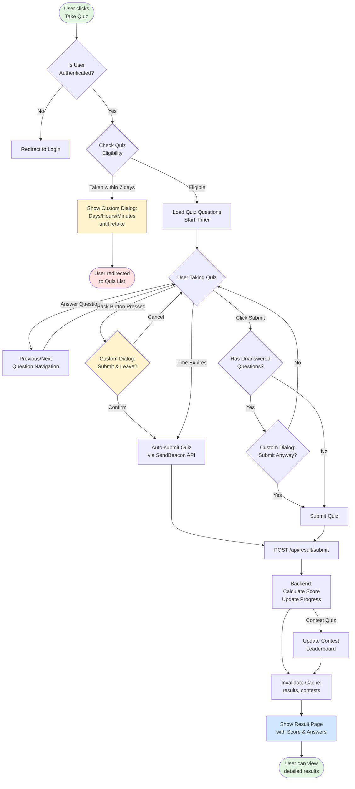

# 🎯 Quiz App - Application Flow

## 📊 System Architecture Overview


---

## 🔐 Authentication Flow


---

## 📝 Quiz Taking Flow



---

## 🏆 Contest Flow


---

## 🔄 Data Caching Strategy


### Cache Durations:
- **Contest Leaderboards**: 30 seconds (live data)
- **Contest List/Details**: 1 minute (semi-live)
- **Quiz List/Details**: 5 minutes (semi-static)
- **Results & Statistics**: 1-2 minutes (dynamic)
- **Categories**: 10 minutes (static)

---

## 👤 User Journey Map


---

## 🛠️ API Architecture

### Backend Routes Structure

```mermaid
graph TD
    Server[Express Server] --> Auth[/api/auth]
    Server --> Quiz[/api/quiz]
    Server --> Result[/api/result]
    Server --> Contest[/api/contests]
    Server --> Category[/api/categories]
    Server --> Profile[/api/profile]
    Server --> Admin[/api/superadmin]
    
    Auth --> Login[POST /login]
    Auth --> Signup[POST /createaccount]
    Auth --> Google[POST /google-auth]
    Auth --> Reset[POST /forgot-password]
    Auth --> Logout[POST /logout]
    
    Quiz --> GetQuizzes[GET /quizzes<br/>🔒 Cache: 5min]
    Quiz --> GetQuiz[GET /quizzes/:id<br/>🔒 Cache: 5min<br/>✓ Eligibility Check]
    Quiz --> CreateQuiz[POST /createquiz<br/>👨‍💼 Admin Only<br/>⚠️ Invalidate Cache]
    Quiz --> UpdateQuiz[PUT /update/:id<br/>👨‍💼 Admin Only<br/>⚠️ Invalidate Cache]
    Quiz --> DeleteQuiz[DELETE /delete/:id<br/>👨‍💼 Admin Only<br/>⚠️ Invalidate Cache]
    
    Result --> Submit[POST /submit<br/>⚠️ Invalidate Cache]
    Result --> GetResults[GET /user<br/>🔒 Cache: 1min]
    Result --> GetStats[GET /user/statistics<br/>🔒 Cache: 2min]
    Result --> GetLeaderboard[GET /leaderboard/:quizId<br/>🔒 Cache: 1min]
    
    Contest --> GetContests[GET /<br/>🔒 Cache: 1min]
    Contest --> GetContest[GET /:id<br/>🔒 Cache: 1min]
    Contest --> JoinContest[POST /:id/join<br/>⚠️ Invalidate Cache]
    Contest --> CreateContest[POST /create<br/>👨‍💼 Admin Only<br/>⚠️ Invalidate Cache]
    Contest --> GetContestLeader[GET /:id/leaderboard<br/>🔒 Cache: 30sec]
    
    style Server fill:#4a90e2
    style Auth fill:#f39c12
    style Quiz fill:#27ae60
    style Result fill:#e74c3c
    style Contest fill:#9b59b6
```

---

## 📱 Frontend Component Hierarchy


---

## 🗄️ Database Schema Relationships


---

## 🎨 Theme & State Management


---

## ⚡ Performance Optimizations


---

## 🔒 Security Features


---

## 📊 Key Application Features

### ✅ Implemented Features

1. **User Management**
   - Registration with email validation
   - Login with JWT authentication
   - Google OAuth 2.0 integration
   - Password reset via email
   - Profile management with image upload
   - Role-based access (User, Admin, SuperAdmin)

2. **Quiz System**
   - Create/Edit/Delete quizzes (Admin)
   - Multiple choice questions
   - Category-based organization
   - Time-limited quiz attempts
   - 7-day retake cooldown with smart display (days/hours/minutes)
   - Automatic scoring
   - Quiz eligibility checks

3. **Contest System**
   - Create contests (Admin)
   - Join contests
   - Live/Upcoming/Completed status
   - Real-time leaderboards with auto-refresh
   - Max participant limits
   - Prize information
   - Contest-specific quizzes

4. **Results & Analytics**
   - Detailed result pages
   - Answer review
   - Personal statistics
   - Progress tracking
   - Quiz leaderboards
   - Contest rankings

5. **UI/UX Enhancements**
   - Dark mode support
   - Custom confirmation dialogs (replace browser alerts)
   - Responsive design (mobile-friendly)
   - Loading states
   - Toast notifications
   - Auto-submit on back button/refresh
   - Smooth animations

6. **Performance**
   - Redis caching (optional)
   - Optimized database queries
   - CDN for images (Cloudinary)
   - Fast API responses
   - Efficient state management

---

## 🚀 Deployment Architecture


---

## 📈 Future Enhancements (Roadmap)


---

## 🎯 Summary

This Quiz App is a full-stack MERN application with:

- **Frontend**: React 18.2 + Vite + Tailwind CSS + React Router
- **Backend**: Node.js + Express 5.1 + MongoDB + Redis (optional)
- **Authentication**: JWT + Google OAuth 2.0
- **Storage**: Cloudinary (images) + MongoDB (data)
- **Performance**: Redis caching with smart invalidation
- **Security**: Bcrypt hashing + JWT tokens + Rate limiting
- **Features**: Quizzes + Contests + Leaderboards + Analytics + User management

The application follows modern best practices with proper separation of concerns, RESTful API design, responsive UI, and scalable architecture.
