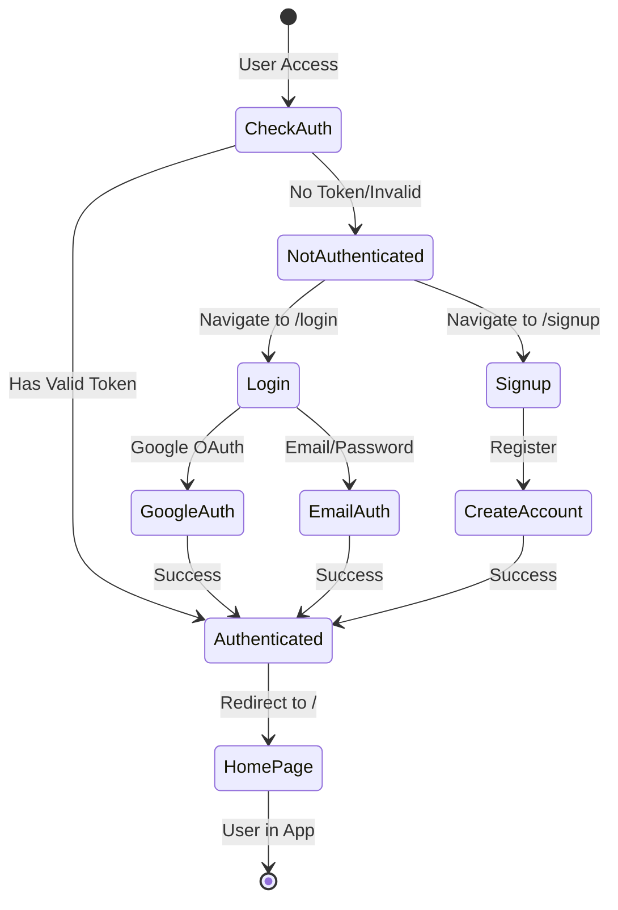
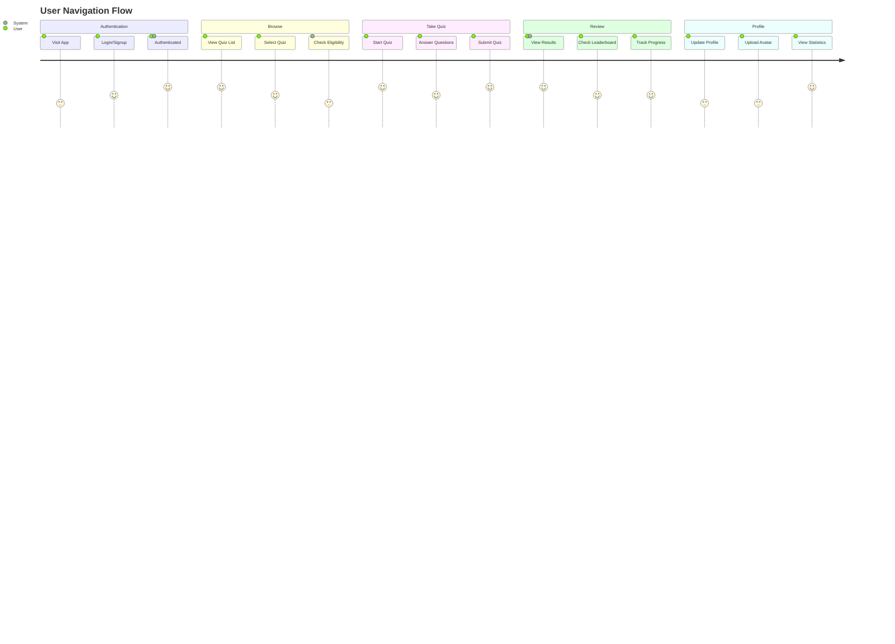
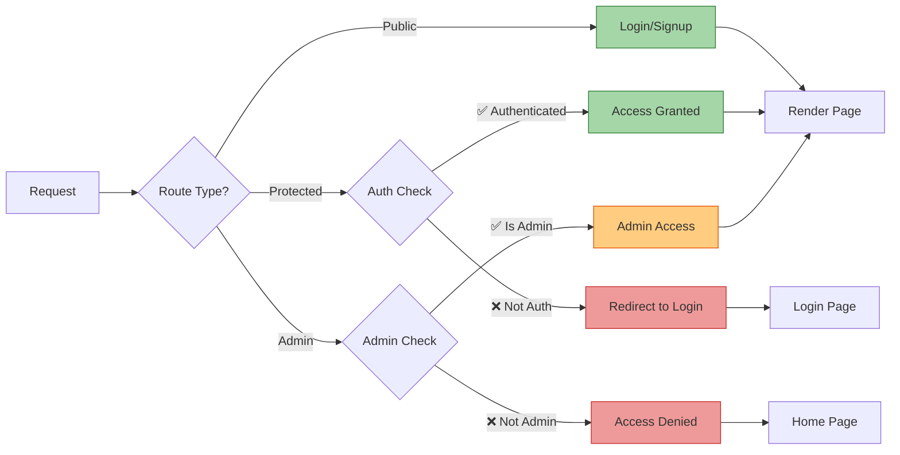
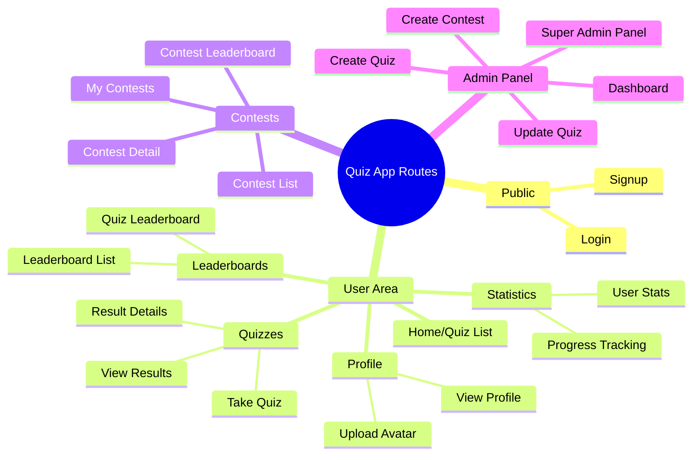
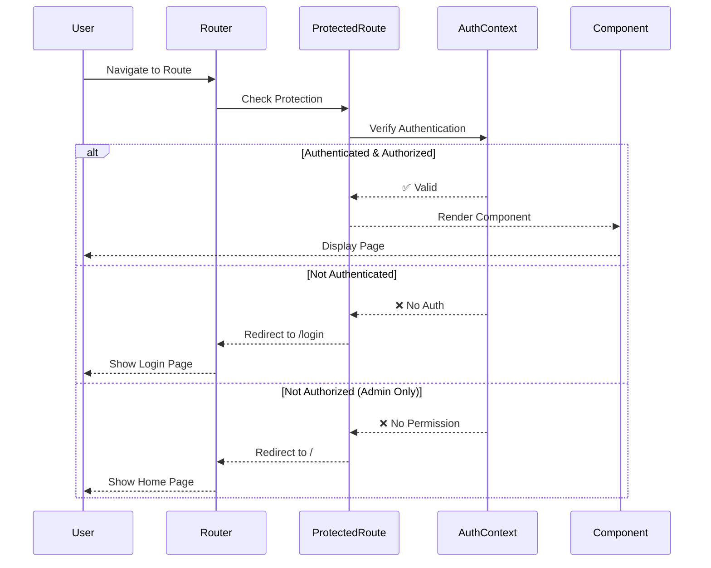

# 🎯 Quiz App - Frontend Routing Flow Diagram

## 📋 Table of Contents
- [Overview](#overview)
- [Route Hierarchy](#route-hierarchy)
- [Detailed Flow Diagram](#detailed-flow-diagram)
- [Route Categories](#route-categories)

---

## Overview

This document provides a comprehensive visual representation of the frontend routing architecture for the Quiz Application. The app uses React Router v6 with protected routes and role-based access control.

---

## Route Hierarchy

```mermaid
graph TB
    Start([User Enters App]) --> Auth{Authenticated?}
    
    Auth -->|No| PublicRoutes[Public Routes]
    Auth -->|Yes| ProtectedRoutes[Protected Routes]
    
    PublicRoutes --> Login[/login<br/>📝 Login Page]
    PublicRoutes --> Signup[/signup<br/>✍️ Signup Page]
    
    ProtectedRoutes --> Home[/<br/>🏠 Quiz List Home]
    ProtectedRoutes --> Profile[/profile<br/>👤 Profile Page]
    ProtectedRoutes --> UploadProfile[/upload-profile<br/>📸 Upload Profile]
    ProtectedRoutes --> ResetPwd[/reset-password/:token<br/>🔒 Reset Password]
    
    ProtectedRoutes --> QuizSection{Quiz Section}
    ProtectedRoutes --> ResultSection{Results Section}
    ProtectedRoutes --> StatsSection{Statistics Section}
    ProtectedRoutes --> ContestSection{Contest Section}
    ProtectedRoutes --> AdminSection{Admin Section}
    
    QuizSection --> TakeQuiz[/quiz/:id<br/>📝 Take Quiz]
    
    ResultSection --> ResultsList[/results<br/>📊 Results List]
    ResultSection --> ResultDetail[/result/:id<br/>📄 Result Detail]
    
    StatsSection --> Statistics[/statistics<br/>📈 User Statistics]
    StatsSection --> Progress[/progress<br/>📊 Progress Tracking]
    StatsSection --> LeaderboardList[/leaderboard<br/>🏆 Leaderboard List]
    StatsSection --> LeaderboardDetail[/leaderboard/:quizId<br/>🥇 Quiz Leaderboard]
    
    ContestSection --> ContestList[/contests<br/>🎪 Contest List]
    ContestSection --> ContestDetail[/contests/:id<br/>🎯 Contest Detail]
    ContestSection --> ContestLeaderboard[/contests/:id/leaderboard<br/>🏅 Contest Leaderboard]
    ContestSection --> MyContests[/my-contests<br/>📋 My Contests]
    
    AdminSection --> RoleCheck{Admin Role?}
    RoleCheck -->|Yes| AdminRoutes[Admin Routes]
    RoleCheck -->|No| Redirect[❌ Access Denied]
    
    AdminRoutes --> AdminDashboard[/admin<br/>⚙️ Admin Dashboard]
    AdminRoutes --> CreateQuiz[/admin/create<br/>➕ Create Quiz]
    AdminRoutes --> UpdateQuiz[/admin/update/:id<br/>✏️ Update Quiz]
    AdminRoutes --> SuperAdmin[/admin/superadmin/panel<br/>👑 Super Admin Panel]
    AdminRoutes --> CreateContest[/contests/create<br/>🎪 Create Contest]
    
    style Start fill:#e1f5ff,stroke:#01579b,stroke-width:3px
    style Login fill:#fff9c4,stroke:#f57f17,stroke-width:2px
    style Signup fill:#fff9c4,stroke:#f57f17,stroke-width:2px
    style Home fill:#c8e6c9,stroke:#2e7d32,stroke-width:2px
    style AdminDashboard fill:#ffccbc,stroke:#d84315,stroke-width:2px
    style SuperAdmin fill:#f8bbd0,stroke:#c2185b,stroke-width:3px
    style Redirect fill:#ffcdd2,stroke:#c62828,stroke-width:2px
```

---

## Detailed Flow Diagram

### 🔐 Authentication Flow



### 🎯 Main User Journey



### 🏗️ Route Protection Layers



---

## Route Categories

### 🌐 Public Routes (No Authentication Required)

| Route | Component | Description | Icon |
|-------|-----------|-------------|------|
| `/login` | Login | User authentication page | 🔑 |
| `/signup` | Signup | New user registration | ✍️ |

### 🔒 Protected Routes (Authentication Required)

#### Core Features

| Route | Component | Description | Icon |
|-------|-----------|-------------|------|
| `/` | QuizList | Home page with available quizzes | 🏠 |
| `/quiz/:id` | TakeQuiz | Take a specific quiz | 📝 |
| `/profile` | ProfilePage | User profile information | 👤 |
| `/upload-profile` | UploadProfile | Upload profile picture | 📸 |
| `/reset-password/:token` | ResetPassword | Password reset page | 🔒 |

#### Results & Analysis

| Route | Component | Description | Icon |
|-------|-----------|-------------|------|
| `/results` | ResultsList | All quiz results | 📊 |
| `/result/:id` | ResultDetail | Detailed result view | 📄 |
| `/statistics` | UserStatistics | Personal performance stats | 📈 |
| `/progress` | ProgressTracking | Learning progress tracker | 📊 |

#### Leaderboards

| Route | Component | Description | Icon |
|-------|-----------|-------------|------|
| `/leaderboard` | LeaderboardList | All leaderboards | 🏆 |
| `/leaderboard/:quizId` | Leaderboard | Quiz-specific leaderboard | 🥇 |

#### Contests

| Route | Component | Description | Icon |
|-------|-----------|-------------|------|
| `/contests` | ContestList | Browse all contests | 🎪 |
| `/contests/:id` | ContestDetail | Contest details & join | 🎯 |
| `/contests/:id/leaderboard` | ContestLeaderboard | Contest rankings | 🏅 |
| `/my-contests` | MyContests | User's participated contests | 📋 |

### 👨‍💼 Admin Routes (Admin Role Required)

| Route | Component | Description | Icon |
|-------|-----------|-------------|------|
| `/admin` | AdminDashboard | Admin control panel | ⚙️ |
| `/admin/create` | CreateQuiz | Create new quiz | ➕ |
| `/admin/update/:id` | UpdateQuiz | Edit existing quiz | ✏️ |
| `/contests/create` | CreateContest | Create new contest | 🎪 |
| `/admin/superadmin/panel` | SuperAdminPanel | Super admin controls | 👑 |

---

## 🎨 Visual Legend

### Route Types
- 🟢 **Public Routes** - Accessible to everyone
- 🔵 **Protected Routes** - Requires authentication
- 🟠 **Admin Routes** - Requires admin privileges
- 🔴 **Redirect** - Automatic navigation

### Components
- 📝 Quiz Related
- 📊 Results & Statistics
- 🏆 Leaderboards
- 🎪 Contests
- 👤 User Profile
- ⚙️ Administration
- 🔒 Security

---

## 🔄 Route Flow Summary



---

## 📊 Route Statistics

- **Total Routes**: 24
- **Public Routes**: 2
- **Protected User Routes**: 13
- **Admin Routes**: 5
- **Contest Routes**: 4

---

## 🛡️ Security Architecture



---

**Last Updated**: December 22, 2025  
**Version**: 1.0  
**Maintained by**: Quiz App Development Team
